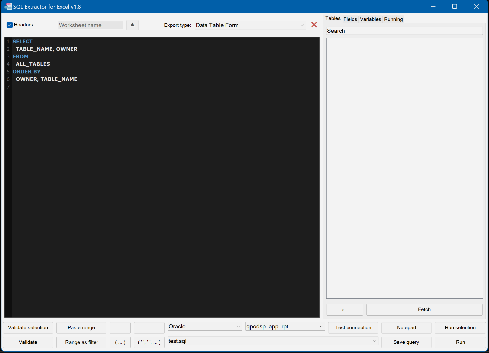

# SQL-Extractor-for-Excel

SQL-Extractor-for-Excel is a practical tool that combines the power of SQL with the flexibility of Excel. It’s a VSTO (Visual Studio Tools for Office) Excel Add-In I created to make my own life easier, and I’m sharing it in case others find it helpful too.

The idea is simple: make it easy to paste SQL query results directly into Excel ranges and quickly add filters to SQL queries from selected ranges. If, like me, you work a lot with both SQL databases and Excel, this tool bridges the two so they work better together, removing time-intensive imports from text files and fighting with Excel's data format issues.

## Table of Contents

- [What It Does](#what-it-does)
- [Why I Made It](#why-i-made-it)
- [Current Status](#current-status)
- [How to Use It](#how-to-use-it)
- [Screenshots](#screenshots)
- [Open Source](#open-source)
- [About Me](#about-me)
- [License](#license)

## What It Does

- **Paste SQL results into Excel**: Run a SQL query and paste the results exactly where you need them in your Excel sheet.
- **Apply SQL filters from Excel**: Select a range in your sheet and add filters like ('value1', 'value2', ..., 'valueN').
- **Simplify running queries at once**: Runs queries in the background without needing to open slow new connections. Each query runs independently and can be easily stopped if needed.

## Why I Made It

I work a lot with SQL and Excel, and I couldn’t find any tool that let me do what I needed in a simple, seamless way, so I built one. This add-in lets me blend SQL queries with Excel data manipulation without exporting/importing files or jumping between tools. It’s still a work-in-progress, but it’s something I use every day, and it keeps getting better.

If you’re in the same boat—using SQL and Excel constantly and wishing the two worked together better—this might just be the thing for you.

## Current Status

This is an ongoing project that’s still evolving. It’s fully functional for day-to-day workflows but definitely rough around the edges. Expect regular updates as I add features, fix bugs, and generally make it more polished.

## How to Use It

### Prerequisites
- Visual Studio 2022 or later
- .NET Framework 4.8
- Microsoft Excel 2016 or later
- Oracle or MS SQL Server databases for connections

### Installation
1. Clone the repository: `git clone https://github.com/abc17tg/SQL-Extractor-for-Excel.git`
2. Open the solution file (.sln) in Visual Studio.
3. Build the solution (Build > Build Solution).
4. The add-in will install automatically in Excel. If not, go to Excel > File > Options > Add-ins > Manage: COM Add-ins > Go, and enable it.

### Usage
1. In Excel, open the add-in pane (usually under the Add-ins tab).
2. Add database connections (supports Oracle and MS SQL Server).
3. Write or paste your SQL query in the add-in.
4. Select a range in Excel to paste results.
5. Run the query—results appear directly in the sheet or designed data table form.

## Screenshots

## Open Source

I’ve decided to make this project open source because I think others might find it useful. Feel free to use it, tinker with it, or suggest improvements. It’s far from perfect, and contributions or feedback are always welcome!

## About Me

I’m just someone who works a lot with SQL and Excel and got tired of importing text files. I made this tool to solve a problem I had, and now I’m sharing it in case others want to use it too. If you have any thoughts, feel free to reach out or open an issue.

## License

This project
